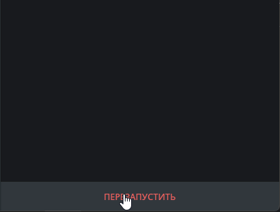

# 🤖 support-bot-aio

Полноценная система поддержки пользователей (support / helpdesk),
реализованная **полностью внутри Telegram** с использованием Python.

🎯 Проект демонстрирует разработку Telegram-бота с системой тикетов,
административной панелью и базой данных SQLite.

---

## 🛠 Стек технологий


---

## 🚀 Возможности
- 📩 Приём сообщений от пользователей
- 🧑‍💼 Система поддержки (операторы / администраторы)
- 🛠 Админ-панель (внутри Telegram)
- 🗄 Хранение данных в базе SQLite3
- 🖼 Поддержка отправки изображений в тикетах
- ⚡ Асинхронная обработка событий
- 🧠 FSM (машина состояний)
- ⌨️ Inline / Reply клавиатуры
- 📦 Гибкая структура проекта


---

<p align="center">
  
</p>
<p align="center"><i>Пример создания тикета в  боте</i></p>


## ⚙️ Установка и запуск

```bash
git clone https://github.com/NESTREN/support-bot-aio.git
cd support-bot-aio
pip install -r requirements.txt
python bot.py
```


## 📁 Структура проекта
```text
support-bot-aio/
│
├── handlers/        # Хендлеры сообщений
├── keyboards/       # Клавиатуры
├── states.py        # FSM состояния
├── bot.py           # Точка входа
├── config.py        # Конфигурация
├── requirements.txt
└── README.md
```

## 👨‍💻 Автор
Юрий — начинающий Python-разработчик, специализирующийся на разработке Telegram-ботов.
